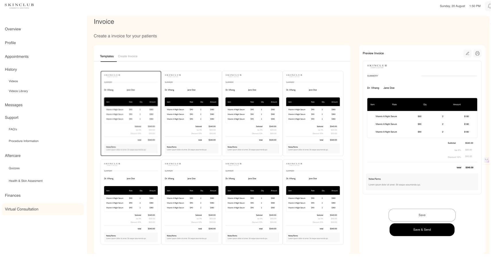

# Skincare Project

Welcome to the Skincare Project! This is a React-based web application aimed at showcasing various frontend skill. The project utilizes styled-components for styling and react-router for navigation between different pages.

## Screenshots

## Features

- **Styled-components**: Utilizes styled-components library for styling, enabling component-based CSS styling for a more maintainable and organized codebase.
- **React Router**: Implements react-router for smooth navigation between different pages within the application.
- **API Integration**: Fetches product images and icons from an open API to provide dynamic content and enhance the user experience.

## Installation

To run this project locally, follow these steps:

1. Clone the repository:
