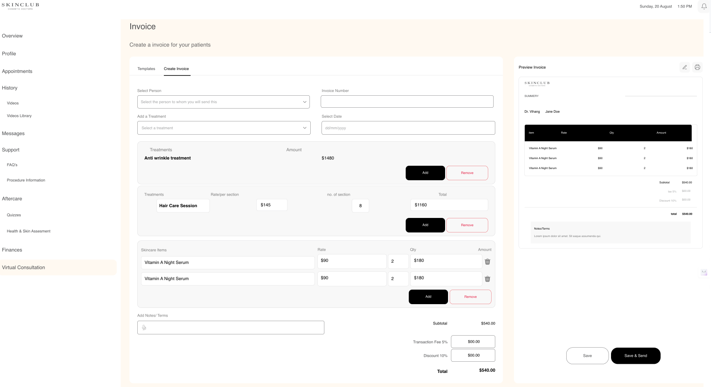
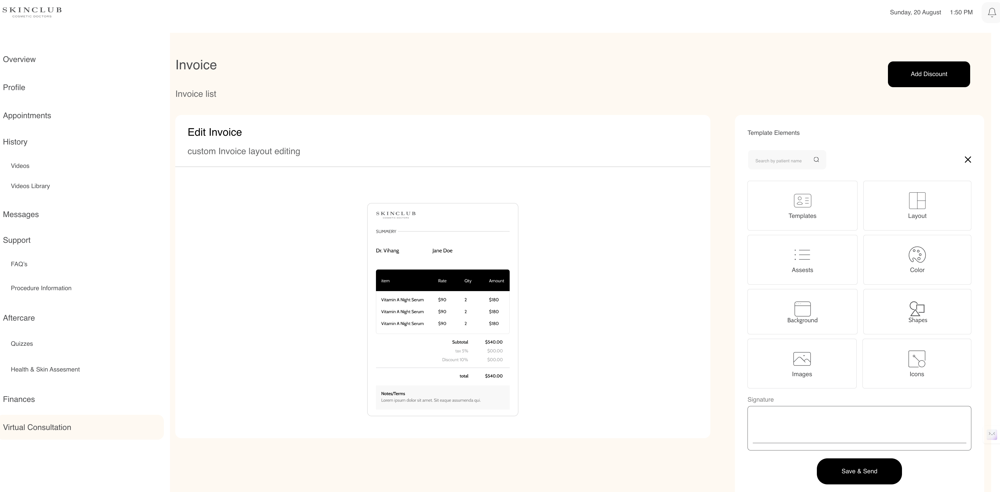
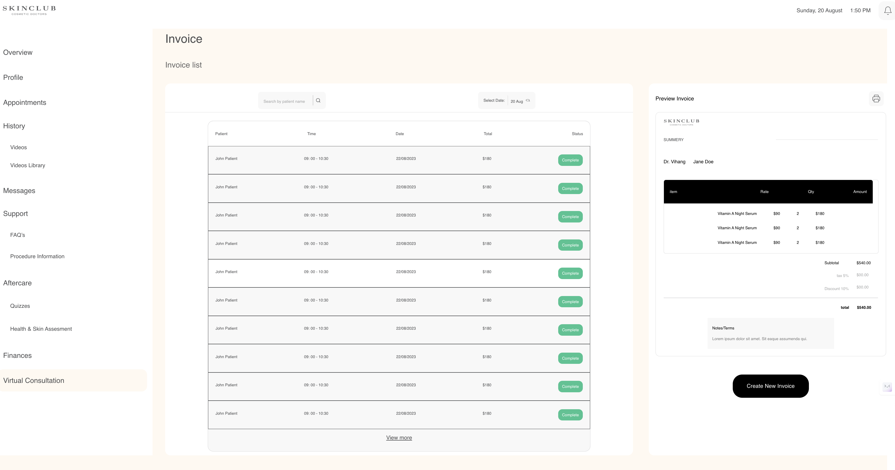
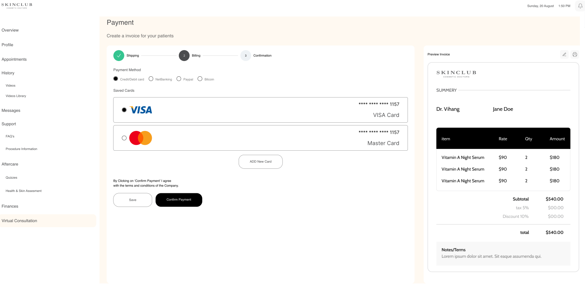
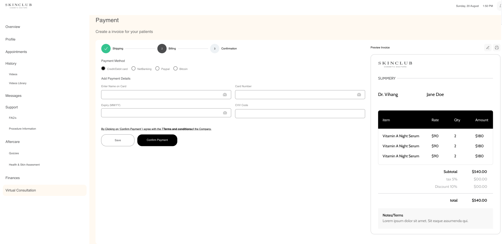

# Skincare Project

Welcome to the Skincare Project! This is a React-based web application aimed at showcasing various frontend skill. The project utilizes styled-components for styling and react-router for navigation between different pages.

## Navigation

To navigate through the website, follow these steps:

1. **Homepage**: Visit the homepage of the website by navigating to `/homepage`.

2. **My Component**: Explore the MyComponent page by navigating to `/mycomponent`.

3. **Edit Invoice**: Access the EditInvoice page by navigating to `/editinvoice`.

4. **Payment**: Proceed to the Payment page by navigating to `/payment`.

5. **Payment Form**: Fill out the PaymentForm by navigating to `/paymentform`.

6. **Templates**: Explore various templates on the Templates page by navigating to `/templates`.

## Website Glimpse
***Templete***

---
***Create Invoice***

---
***Edit Invoice***

---
***Invoice List***

---
***Payment***

---
***Payment Form***

## Features

- **Styled-components**: Utilizes styled-components library for styling, enabling component-based CSS styling for a more maintainable and organized codebase.
- **React Router**: Implements react-router for smooth navigation between different pages within the application.
- **API Integration**: Fetches product images and icons from an open API to provide dynamic content and enhance the user experience.

## Installation

To run this project locally, follow these steps:

1. Clone the repository:
